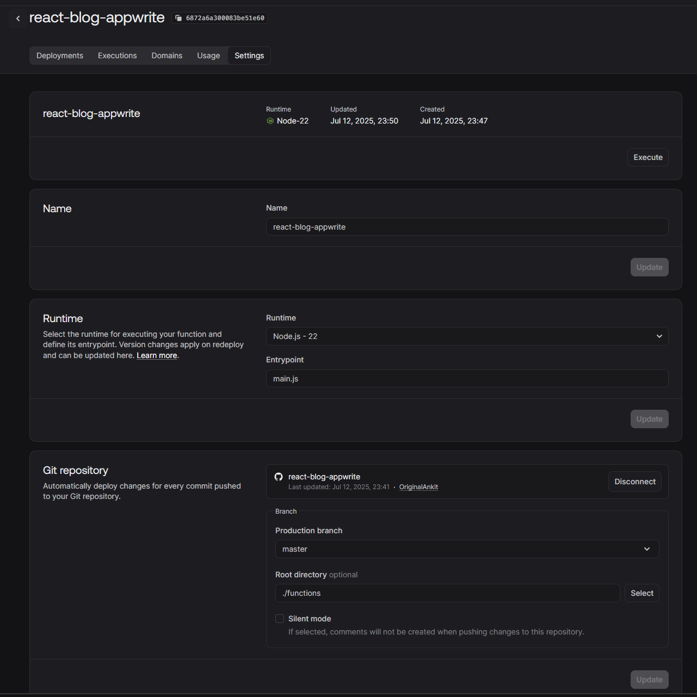
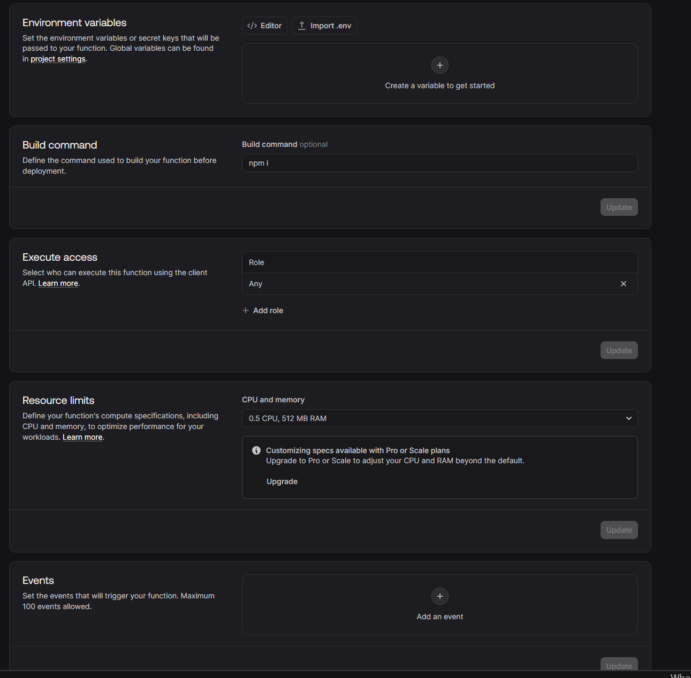

## Issues
- It doesn't support folder in buckets
- One can't create relationship with AUTH user table
- Ids of table, database , storage etc are random -> difficult to create seperate enviroments
- migration difficult
- Permission are not very Flexible
    - Document level permission once assingned can't be modified directly -> need to run scripts
    - can't give permissions by fields in db -> example if I want to give access to premium content to users which are memebers for more than 5 years 

## Benefits
- Easy to setup
- scalable
- functions are good , it can be used as a cron,event etc
- all requirements under 1 roof -> db,notification module,storage etc

## NOTES:
functions deployment using same repo
- can use enviroment variables or entry points to deploy multiple functions
- setting are as below
check build command, entry point, root directory

